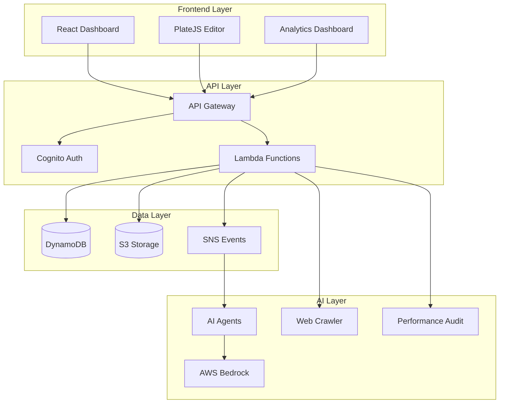

# Neuralynx - AI-Powered Content Optimization Platform

[](https://opensource.org/licenses/MIT)
[](https://aws.amazon.com/)
[](https://reactjs.org/)
[](https://www.typescriptlang.org/)
[](https://aws.amazon.com/cdk/)

Neuralynx is a comprehensive AI-powered platform that combines domain analysis, content optimization, and intelligent agent automation to help businesses enhance their digital presence and content strategy. Built with modern serverless architecture on AWS, it provides a complete solution for content creators, marketers, and businesses looking to optimize their online content and improve SEO performance.

## 🌟 Overview

Neuralynx consists of three main components working together to provide a complete content optimization ecosystem:

- **🎨 Frontend Dashboard** - Modern React-based interface for content management and analytics
- **⚡ Backend Infrastructure** - Serverless AWS-based API with domain analysis and content processing
- **🤖 AI Agents** - Specialized Bedrock-powered agents for content generation and optimization

## 🏗️ System Architecture



## 🚀 Key Features

### 🎯 **Domain Analysis & Content Crawling**
- **Automated Web Crawling**: Full website analysis using Playwright
- **Performance Auditing**: Lighthouse integration for SEO, accessibility, and performance metrics
- **Sitemap Processing**: XML sitemap parsing and URL extraction
- **Content Conversion**: HTML to Markdown conversion with metadata extraction

### 🤖 **AI-Powered Content Optimization**
- **Intelligent Keyword Generation**: AI-generated SEO keywords using AWS Bedrock
- **Content Enhancement**: AI-driven content recommendations and optimization
- **Business Analysis**: Automated domain analysis and business categorization
- **Multi-Platform Content**: Platform-specific content generation for social media

### 📊 **Advanced Analytics & Management**
- **Real-time Analytics**: Content performance tracking and insights
- **Topic Management**: Organize and categorize content by topics
- **Rich Text Editor**: PlateJS editor with AI integration
- **User Management**: Secure authentication and user profiles

### 🔧 **Specialized AI Agents**
- **Business Query Generator**: Creates user queries for LLM visibility
- **Content Generator**: Platform-specific content for social media
- **Content Optimizer**: SEO and engagement optimization
- **Domain Analyzer**: Comprehensive business domain analysis

## 📁 Project Structure

```
Neuralynx/
├── neuralnyx-front-end/          # React dashboard application
│   ├── website/                  # Main frontend application
│   │   ├── src/
│   │   │   ├── components/       # Reusable UI components
│   │   │   ├── modules/          # Feature modules
│   │   │   ├── contexts/         # React contexts
│   │   │   ├── hooks/            # Custom hooks
│   │   │   └── lib/              # Utilities and API client
│   │   └── package.json
│   └── cdk/                      # Frontend infrastructure
├── neuralnyx-backend/            # Serverless backend infrastructure
│   ├── lambda/                   # Lambda function implementations
│   ├── lib/                      # CDK stack definitions
│   ├── models/                   # Data models
│   └── package.json
└── neuralnyx-agents/             # AI agent microservices
    ├── business-query-generator/ # Query generation agent
    ├── content-generator/        # Content creation agent
    ├── content-optimization/     # Content optimization agent
    └── domain-analyzer/          # Domain analysis agent
```

## 🛠️ Technology Stack

### **Frontend**
- **React 19** - Modern UI framework with concurrent features
- **TypeScript** - Type-safe development
- **Vite** - Fast build tool and dev server
- **Tailwind CSS** - Utility-first CSS framework
- **PlateJS** - Rich text editor with AI integration
- **shadcn/ui** - Modern component library
- **React Query** - Data fetching and caching
- **React Router** - Client-side routing

### **Backend**
- **AWS CDK v2** - Infrastructure as Code
- **TypeScript** - Type-safe serverless development
- **AWS Lambda** - Serverless compute
- **API Gateway** - REST API management
- **DynamoDB** - NoSQL database with streams
- **S3** - File storage and static hosting
- **SNS** - Event-driven messaging
- **Cognito** - User authentication and management

### **AI & Machine Learning**
- **AWS Bedrock** - AI model access (Claude, Llama)
- **Bedrock AgentCore** - Conversational AI capabilities
- **OpenAI API** - Content generation and optimization
- **Playwright** - Browser automation and web crawling
- **Lighthouse** - Web performance auditing

### **Development & Deployment**
- **Docker** - Containerization
- **LocalStack** - Local AWS development
- **Jest** - Testing framework
- **Prettier** - Code formatting
- **ESLint** - Code linting

## 🚀 Quick Start

### Prerequisites

- **Node.js** (v18 or higher)
- **Python** (3.13+ for agents)
- **AWS CLI** configured with appropriate credentials
- **Docker** (for LocalStack and containerized services)
- **CDK CLI**: `npm install -g aws-cdk`

### 1. Clone the Repository

```bash
git clone <repository-url>
cd Neuralynx
```

### 2. Backend Setup

```bash
cd neuralnyx-backend

# Install dependencies
npm install

# Start LocalStack for local development
docker-compose up -d

# Deploy to LocalStack
make install
make deploy

# Check deployment status
make outputs
```

### 3. Frontend Setup

```bash
cd neuralnyx-front-end/website

# Install dependencies
npm install

# Start development server
npm run dev
# Runs at http://localhost:5173
```

### 4. AI Agents Setup

```bash
cd neuralnyx-agents

# Copy environment template
cp env.example .env

# Configure environment variables
# Edit .env with your API keys

# Run individual agents
cd business-query-generator
python app.py
```

## 🔧 Configuration

### Environment Variables

#### Backend Configuration
```bash
# LocalStack (for development)
LOCALSTACK_ENDPOINT=http://localhost:4566

# AWS Configuration
AWS_REGION=ap-southeast-1
AWS_ACCOUNT_ID=your-account-id

# Database Tables
DOMAIN_TABLE_NAME=neuralynx-domains
CONTENT_TABLE_NAME=neuralynx-content
TOPICS_TABLE_NAME=neuralynx-topics
```

#### Frontend Configuration
```bash
# API Configuration
VITE_PUBLIC_API_URL=http://localhost:3000

# AWS Amplify
VITE_AWS_REGION=ap-southeast-1
VITE_USER_POOL_ID=your-user-pool-id
VITE_USER_POOL_CLIENT_ID=your-client-id
```

#### AI Agents Configuration
```bash
# OpenAI Configuration
OPENAI_API_KEY=your_openai_api_key_here
OPENAI_MODEL=gpt-4

# AWS Configuration
AWS_ACCESS_KEY_ID=your_aws_access_key
AWS_SECRET_ACCESS_KEY=your_aws_secret_key
AWS_DEFAULT_REGION=us-east-1
```

## 📊 API Documentation

### Authentication Endpoints
- `POST /auth/signup` - User registration
- `POST /auth/login` - User login
- `POST /auth/refresh` - Token refresh

### Domain Management
- `GET /domains` - List user domains
- `POST /domains` - Create new domain
- `DELETE /domains/{domain}` - Delete domain

### Content Operations
- `POST /content` - Get content by URL
- `POST /content/list` - List domain content
- `POST /content/delete` - Delete content

### Analysis & Processing
- `POST /sitemap` - Crawl sitemap
- `POST /lighthouse` - Run Lighthouse audit
- `POST /keywords` - Generate AI keywords
- `POST /bedrock-agent` - AI agent interaction

### Topic Management
- `GET /topics` - List user topics
- `POST /topics` - Create topic
- `GET /topics/{domain}` - Get domain topics
- `PUT /topics/{domain}/{id}` - Update topic
- `DELETE /topics/{domain}/{id}` - Delete topic

### System
- `GET /health` - Health check
- `GET /docs` - API documentation (Swagger UI)
- `GET /swagger.json` - OpenAPI specification

## 🏃‍♂️ Development Workflow

### Local Development

1. **Start LocalStack**:
   ```bash
   cd neuralnyx-backend
   docker-compose up -d
   ```

2. **Deploy Backend**:
   ```bash
   make deploy
   ```

3. **Start Frontend**:
   ```bash
   cd neuralnyx-front-end/website
   npm run dev
   ```

4. **Run AI Agents** (optional):
   ```bash
   cd neuralnyx-agents/business-query-generator
   python app.py
   ```

### Testing

```bash
# Backend tests
cd neuralnyx-backend
npm test

# Frontend tests
cd neuralnyx-front-end/website
npm run lint
npm run type-check
```

### Building for Production

```bash
# Build frontend
cd neuralnyx-front-end/website
npm run build

# Deploy backend to AWS
cd neuralnyx-backend
cdk deploy --context environment=production
```

## 🚀 Deployment

### AWS Deployment

#### Backend Infrastructure
```bash
cd neuralnyx-backend

# Bootstrap CDK (first time only)
cdk bootstrap

# Deploy to AWS
cdk deploy --context environment=production
```

#### Frontend Infrastructure
```bash
cd neuralnyx-front-end/cdk

# Deploy S3 + CloudFront
npm run deploy
```

#### AI Agents Deployment
```bash
cd neuralnyx-agents/business-query-generator

# Deploy to ECR/ECS
chmod +x deploy-ecr.sh
./deploy-ecr.sh
```

### Environment Configuration

- **local**: LocalStack development environment
- **staging**: AWS staging environment
- **production**: AWS production environment

## 📈 Performance & Scaling

### Auto-scaling Features
- **DynamoDB**: Auto-scaling based on demand
- **Lambda**: Concurrency limits and auto-scaling
- **S3**: Transfer acceleration and lifecycle policies
- **CloudFront**: Global CDN distribution

### Optimization
- **ARM64 Lambda**: Cost-effective compute
- **Container Image Caching**: Faster cold starts
- **S3 Presigned URLs**: Secure file access
- **DynamoDB Batch Operations**: Efficient data processing

## 🔒 Security

### Authentication & Authorization
- **JWT Tokens**: Secure API access with expiration
- **Refresh Token Rotation**: Enhanced security
- **IAM Roles**: Fine-grained permissions
- **CORS Configuration**: Cross-origin request handling

### Data Protection
- **Encryption at Rest**: DynamoDB and S3 encryption
- **Encryption in Transit**: HTTPS enforcement
- **Secure Parameter Storage**: SSM Parameter Store
- **VPC Endpoints**: Optional network isolation

## 📊 Monitoring & Logging

### CloudWatch Integration
- **Lambda Function Logs**: Structured logging with correlation IDs
- **API Gateway Access Logs**: Request/response tracking
- **DynamoDB Metrics**: Performance monitoring
- **SNS Delivery Status**: Message processing tracking

### Error Handling
- **Structured Error Responses**: Consistent error format
- **Error Logging**: DynamoDB error tracking
- **Automatic Retry Mechanisms**: Resilient processing
- **Dead Letter Queues**: Failed message handling

## 🤝 Contributing

### Development Workflow
1. Fork the repository
2. Create a feature branch: `git checkout -b feature/amazing-feature`
3. Make your changes with tests
4. Run tests: `make test` and `make format:check`
5. Commit your changes: `git commit -m 'Add amazing feature'`
6. Push to the branch: `git push origin feature/amazing-feature`
7. Submit a pull request

### Code Standards
- **TypeScript Strict Mode**: Type safety enforcement
- **Prettier Formatting**: Consistent code style
- **ESLint Configuration**: Code quality checks
- **Comprehensive Error Handling**: Robust error management
- **Test Coverage**: Unit and integration tests

## 📝 License

This project is licensed under the MIT License - see the [LICENSE](LICENSE) file for details.

## 🆘 Support & Troubleshooting

### Documentation
- **API Documentation**: Available at `/docs` endpoint
- **OpenAPI Specification**: Available at `/swagger.json`
- **Architecture Diagrams**: See `diagram.png` in backend

### Common Issues

#### Backend Issues
- **LocalStack not starting**: Check Docker is running
- **Deployment failures**: Verify AWS credentials and permissions
- **Lambda timeouts**: Check function memory and timeout settings

#### Frontend Issues
- **Build failures**: Ensure all dependencies are installed
- **API connection errors**: Verify backend is running and accessible
- **Authentication issues**: Check Cognito configuration

#### AI Agents Issues
- **OpenAI API errors**: Verify API key and quota
- **Bedrock access denied**: Check IAM permissions
- **Container deployment failures**: Verify ECR repository exists

### Getting Help
1. Check the logs in CloudWatch (AWS) or LocalStack logs
2. Review the API documentation at `/docs`
3. Test locally first before deploying
4. Create an issue with detailed logs and error messages

## 🔄 Version History

- **v1.0.0** - Initial release with core functionality
- **v1.1.0** - Added AI agents and Bedrock integration
- **v1.2.0** - Enhanced frontend with PlateJS editor
- **v1.3.0** - Improved performance and monitoring
- **v1.4.0** - Added comprehensive analytics dashboard

## 🌟 Features Roadmap

### Upcoming Features
- **Multi-language Support**: Internationalization
- **Advanced Analytics**: Machine learning insights
- **Team Collaboration**: Multi-user workspaces
- **API Rate Limiting**: Enhanced API management
- **Mobile App**: React Native application

### Integration Plans
- **Slack Integration**: Team notifications
- **Google Analytics**: Traffic data integration
- **WordPress Plugin**: Direct CMS integration
- **Zapier Connectors**: Workflow automation

---

**Built with ❤️ using AWS CDK, React, TypeScript, and modern serverless architecture.**

For more detailed information about specific components, please refer to the individual README files in each directory:
- [Backend Documentation](neuralnyx-backend/README.md)
- [Frontend Documentation](neuralnyx-front-end/website/README.md)
- [AI Agents Documentation](neuralnyx-agents/README.md)
- [Infrastructure Documentation](neuralnyx-front-end/cdk/README.md)

